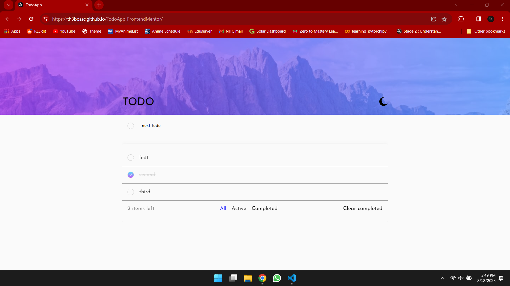
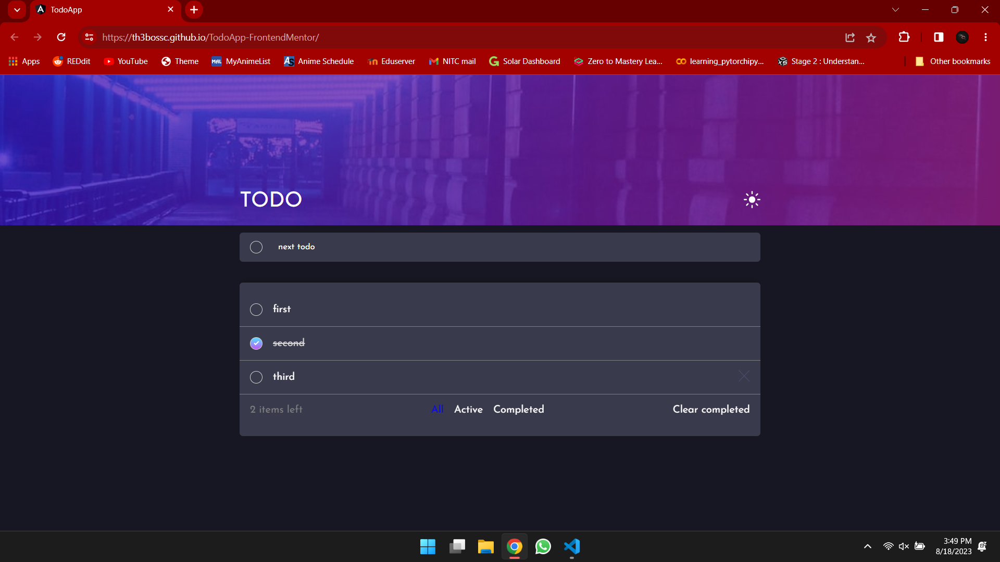

# Frontend Mentor - Todo app solution

This is a solution to the [Todo app challenge on Frontend Mentor](https://www.frontendmentor.io/challenges/todo-app-Su1_KokOW). Frontend Mentor challenges help you improve your coding skills by building realistic projects. 

## Table of contents

- [Overview](#overview)
  - [The challenge](#the-challenge)
  - [Screenshot](#screenshot)
  - [Links](#links)
- [My process](#my-process)
  - [Built with](#built-with)
  - [What I learned](#what-i-learned)
  - [Useful resources](#useful-resources)
- [Author](#author)
- [Acknowledgments](#acknowledgments)

## Overview

### The challenge

Users should be able to:

- View the optimal layout for the app depending on their device's screen size
- See hover states for all interactive elements on the page
- Add new todos to the list
- Mark todos as complete
- Delete todos from the list
- Filter by all/active/complete todos
- Clear all completed todos
- Toggle light and dark mode
- **Bonus**: Drag and drop to reorder items on the list

### Screenshot

### Links

- Live Site URL: [Hosted on Github Pages](https://th3bossc.github.io/TodoApp-FrontendMentor/)

## My process

### Built with

- Semantic HTML5 markup
- CSS custom properties
- Flexbox
- CSS Grid
- [AngularJs](https://angular.io/) - JS Framework
- [Angular Material](https://material.angular.io/) - For drag and drop functionality
- [Sass](https://sass-lang.com/) - CSS Preprocessor

### What I learned

I learnt to work with drag and drop API in Javascript, and how to use prewritten APIs and components from Angular Material throughout this project

### Useful resources

- [Angular Documentation](https://angular.io/) - Angular is one of the best JavaScript frameworks available and it makes writing frontend code much easier than vanilla Javascript
- [Angular Material Drag and Drop API](https://material.angular.io/cdk/drag-drop/overview) - Drag and drop API provided by Angular Material has additional functionality such as easier binding with javascript elements such as arrays to keep track of change, as well as documentation on how to create smooth animations that work well with the dragging function.

## Author

- Website - [Diljith P D](https://th3bossc.github.io/Portfolio/)
- Frontend Mentor - [@th3bossc](https://www.frontendmentor.io/profile/th3bossc)

## Acknowledgments

I thank my collegues for helping me in the challenges i faced, as well as the youtube channels, Kevin Powell and webdevsimplified for the robust frontend tips which came in handy while working on this website